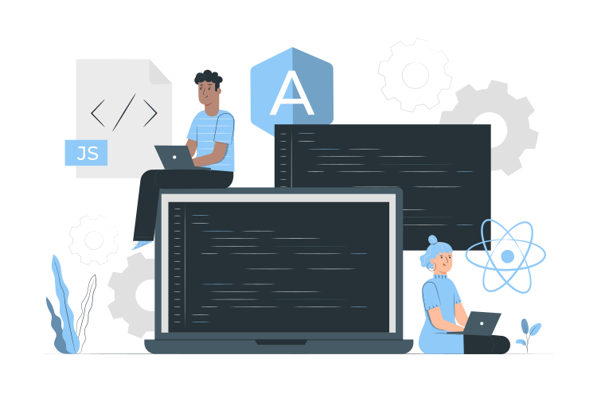

<h2>Hi There, I'm Lucas Pazzim </h2>

    

  
  

     

### About me

- I'm passionate about technology and innovation.
- Currently improving my frontend skills in React and Angular.
- I’m looking forward to collaborating on innovation projects.
- You can reach me on <a style="font-weight: bold;" href="https://www.linkedin.com/in/lucaspazzim/">Linkedin.</a>

### Languages and Tools

 

  
  
  
  
  
  
  
   
  
  
    

### Social Media

 

  
  
  
  
  
  

   
    <a style="font-size:8px" href="https://storyset.com/web">Web illustrations by Storyset</a>
  

